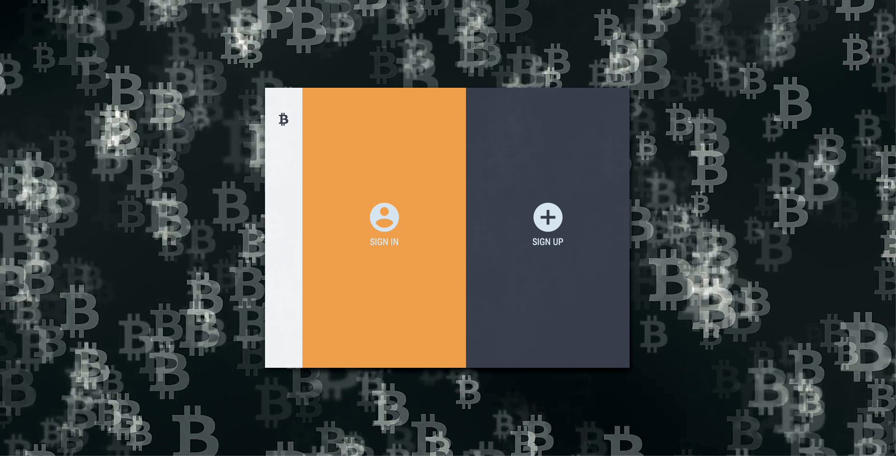
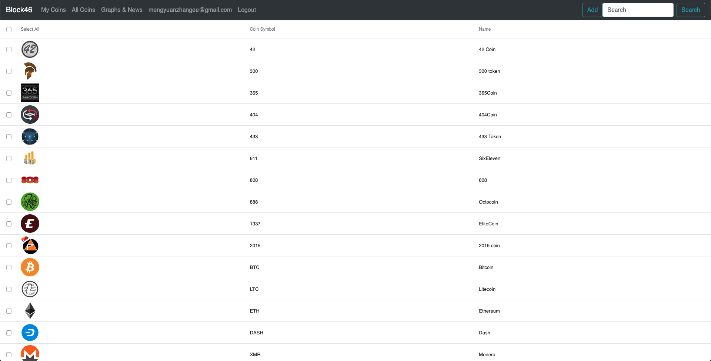
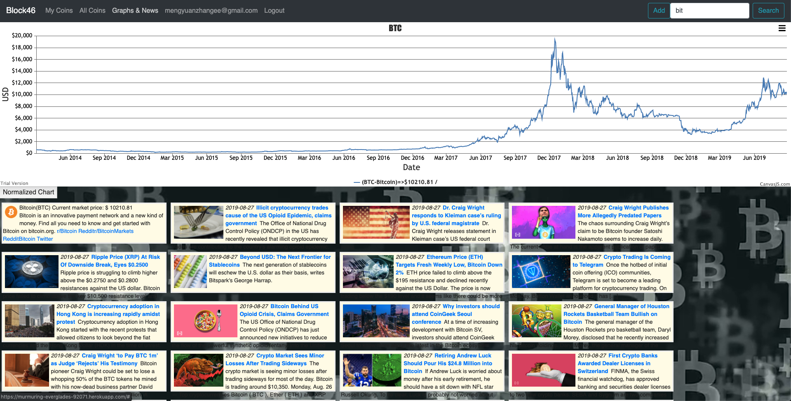

# BLOCK 46
Block 46 is a cryptocurrency profile app that helps you keep track of your block-chain investments. It has a fully functional user-authentication system based on passportjs. Upon logging in, the user can build up a profile by saving the crypocurrency items. For each cryptocurrency item, user can view the historical value and the latest news.

https://murmuring-everglades-92071.herokuapp.com/ 

http://www.block46.net

---

## Login/SignUp Page
Click Login or Signup half window to login or signup on the awesome Block 46 website!

## All Coin DataTable
Upon logging in, the full datatable will show up by default. User can search and select the interested items and save them to the profile. The personal cryptocurrency profile is in the "saved" tab.

## Historical Value and News
Select one of the cryptocurrency item and click "Graph And News" tab. Check out the historical value of this currency and the related news up to date!

## References
### front-end login page template:
https://github.com/NadiKuts/react-signin-form

### React router + passport authentication:
https://github.com/netpoetica/react-router-passport-express-demo-app

### React DataTable

### React Canvas JS

# API Routes
**post [/api/admin/cryptocompare]** 
 creates coins table for all cryptocurremncies. It's a one time job. Only administrator can do.

**post [/api/admin/cryptocontrol]** 
 creates headline table from "cryptocontrol". It's a one time job. Only administrator can do.

**get [/api/coins]** 
 lists all coins information from the coins table, which is generated by /api/admin/cryptocompare

**get [/api/coins/:id]** 
 displays coin (id) information, including current market price.

**get [/api/coins/history/:id]** 
 updates (or creates) historical daily close price (in USD) for cryptocurrency (id). If hr data is existing in the database, the program will check whether or not it is up to date and add new data to the database.

**get [/api/coins/info/:id]** 
 displays coin (id) basic information, including short description and websites. If these data are unavailable, the basic informaton from coins table will be listed.

**get [/api/coins/news/:id]** 
 displays the latest news regarding a specific coin (id). The source is from "cryptoconrtrol"

**put [/api/coins/:user/add?coinIds=1182,2203,...]** 
 adds coins to :user's watch list. (in users table) The program doesn't validate the id. (invalid id will exist, but no harm)

**get [/api/coins/:user/view]**  
displays a specific user (:user) watched coins (display coin id only)

**put [/api/coins/:user/remove?coinIds=1182,4321, ...]** 
 removes watched coins

Other user authentication API

[/logout]
[/isloggedin]
[/local/login]
[/local/loginFail]
[/local/loginSuccess]
[/local/signup]
[/local/signupFail]
[/local/signupSuccess]

